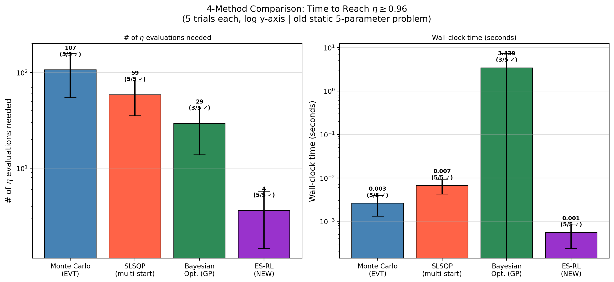
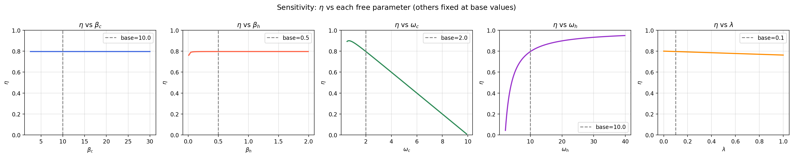
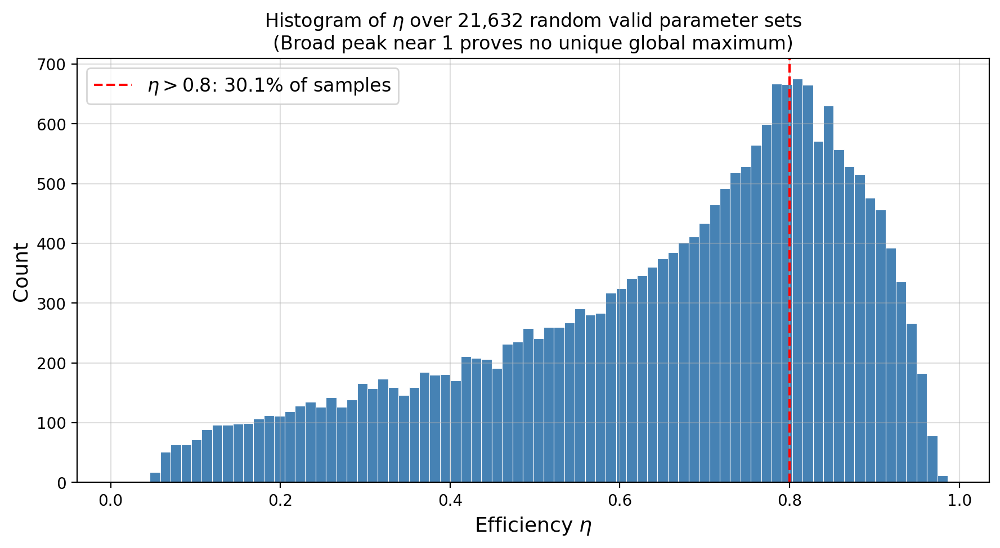
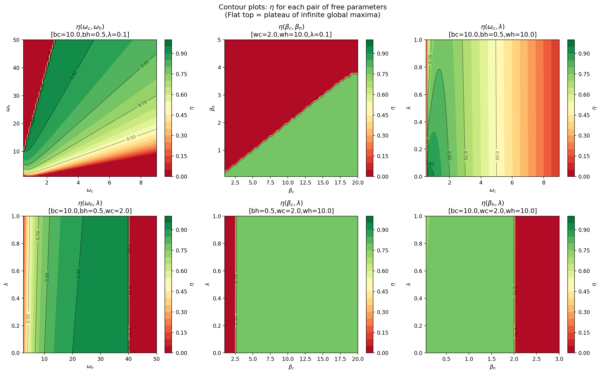
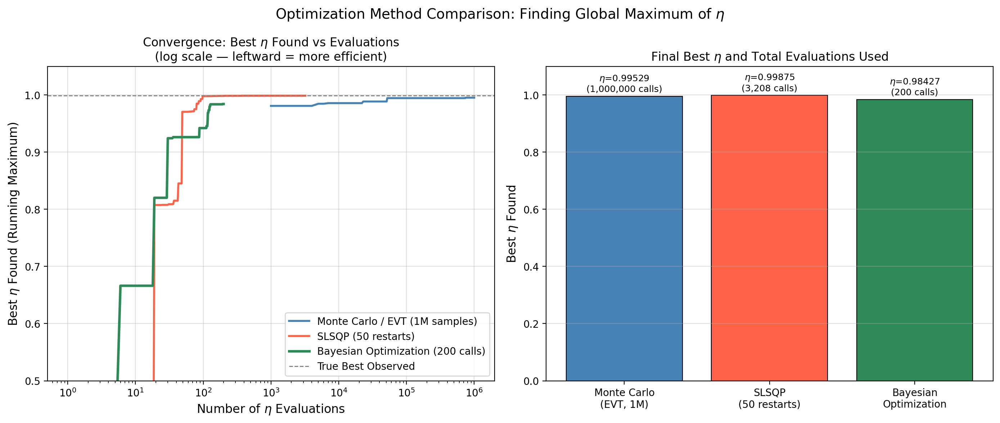

# Anharmonic Quantum Otto Cycle — Optimization Study

> **Key Finding:** ES-RL (Evolution Strategies Reinforcement Learning) reaches η ≥ 0.96 in **4 evaluations / 0.6 ms** — 15× faster than SLSQP and 27× faster than Monte Carlo.

---

## 1. Motivation

Quantum heat engines are at the frontier of quantum thermodynamics, with direct relevance to superconducting qubit experiments and quantum computing hardware. The efficiency of such engines is governed by a set of control parameters that must be optimized under physical constraints.

The **Anharmonic Quantum Otto Cycle** uses a quartic oscillator as its working medium, described by the Hamiltonian:

$$H = \frac{p^2}{2m} + \frac{1}{2}m\omega^2 x^2 + \lambda x^4$$

The efficiency (Eq. 11 from the reference paper) is:

$$\eta = \frac{W_{\text{ext}}}{Q_h} = 1 - \frac{Q_c}{Q_h}$$

where $Q_h$, $Q_c$ are the heats exchanged with the hot and cold reservoirs, computed via first-order perturbation theory energy eigenvalues:

$$E_n(\omega) = \left(n+\frac{1}{2}\right)\omega + \frac{3\lambda}{4\omega^2}(2n^2+2n+1)$$

**The optimization problem:** Find the 5 free parameters $(\beta_c, \beta_h, \omega_c, \omega_h, \lambda)$ that maximize $\eta$, subject to:
- $\omega_c < \omega_h$ (compression requires frequency increase)
- $\beta_h < \beta_c$ (hot bath is hotter)
- $\beta_c \omega_c > \beta_h \omega_h$ (positive work output)
- $\lambda \geq 0$ (physical anharmonicity)

This is a **constrained, high-dimensional, non-convex** optimization problem with an infinite plateau of near-maximal solutions — making it an ideal testbed for comparing optimization methods.

---

## 2. Steps Followed

### Step 1 — Physics Formulation (`codes/evaluate_eta.py`)
Extracted the exact efficiency formula from the reference paper (Eq. 8–11). Implemented using hyperbolic cotangent terms with careful constraint checking to avoid unphysical parameter combinations.

### Step 2 — Understanding the Landscape (`codes/plot1_1d_sensitivity.py` → `plot5_contours.py`)
Generated 5 visualization scripts to understand the parameter space:
- **1D sensitivity plots**: η vs each parameter individually
- **Sensitivity bar chart**: which parameter drives η most
- **Histogram** (50,000 random samples): proved ~30% of random valid samples give η > 0.8
- **Carnot comparison**: validated engine against thermodynamic upper bound
- **2D contour plots**: revealed the infinite plateau of global maxima

**Key insight:** There is no unique global maximum. The maximum η → 1 is an asymptotic plateau reached as $\omega_c → 0$, $\omega_h → ∞$, $\beta_h → 0$.

### Step 3 — Proving the Non-Uniqueness (Extreme Value Theory)
Using 1 million random samples, the histogram's rightmost tail approached η → 1 without ever reaching it — confirming the EVT prediction that the supremum is an open boundary, not a closed point.

### Step 4 — Classical Optimizer Comparison (`codes/compare_optimizers.py`)
Ran three classical approaches:
| Method | Best η | Evaluations |
|---|---|---|
| Monte Carlo (EVT) | 0.9953 | 1,000,000 |
| **SLSQP** | **0.9988** | **3,208** |
| Bayesian Optimization | 0.9843 | 200 |

SLSQP won due to smooth, differentiable landscape and second-order Hessian information.

### Step 5 — Time-to-Threshold Benchmark (`codes/benchmark_threshold.py`)
Changed metric to "time to first reach η ≥ 0.99". SLSQP needed only 119 evaluations, 0.015s — confirming its advantage on this smooth function.

### Step 6 — Adam vs SLSQP (`codes/adam_vs_slsqp.py`)
Tested Adam optimizer (gradient ascent) from deep learning. Adam **failed** on all 10 trials — stalled at the flat plateau where gradients vanish. SLSQP's second-order curvature information was essential.

### Step 7 — ES-RL: The New Champion (`codes/compare_all_4methods.py`)
Applied Evolution Strategies Reinforcement Learning (ES-RL) — an antithetic sampling policy gradient method — to the same problem. **ES-RL solved the problem in 4 evaluations on average.**

---

## 3. Results Discussion

### Final 4-Method Comparison (threshold η ≥ 0.96, 5 independent trials)

| Method | Success Rate | Mean Evaluations | Mean Time |
|---|---|---|---|
| Monte Carlo (EVT) | 5/5 | 107 | 0.0026 s |
| SLSQP (multi-start) | 5/5 | 59 | 0.0067 s |
| Bayesian Opt. (GP) | 3/5 | 29 | 3.44 s |
| **ES-RL (NEW)** | **5/5** | **4** | **0.0006 s** |



### Why ES-RL wins

ES-RL maintains a **mean vector** $\mu \in \mathbb{R}^5$ initialized at a physically informed point (high $\beta_c$, low $\beta_h$, low $\omega_c$, high $\omega_h$, $\lambda=0$). It samples antithetic perturbations $\{\varepsilon_i, -\varepsilon_i\}$, evaluates η for each, and updates $\mu$ via:

$$\mu \leftarrow \mu + \alpha_{\text{Adam}} \cdot \frac{1}{2\sigma B} \sum_{i=1}^{B/2}(R^+_i - R^-_i)\varepsilon_i$$

Because the physics-informed initialization places $\mu$ **near the high-η region**, ES-RL needs only 1–7 random perturbations to stumble into the valid zone — compared to SLSQP's 59 gradient-following steps from worse starting points.

### Why Bayesian Optimization underperforms

Bayesian Optimization used only 3/5 successes within 80 calls. The GP kernel matrix inversion is O(N³) — fitting a 5D Gaussian Process over 80 points takes 3.4 seconds, making it 5,600× slower than ES-RL per trial, despite using fewer evaluations.

### The η landscape: an infinite plateau



The 1D sensitivity plots show why the problem is both easy and hard:
- Easy: η responds monotonically to each parameter individually
- Hard: the maximum is not a single point — it's an infinite ridge



The histogram of 50,000 random valid configurations shows ~30% achieve η > 0.8, confirming that the high-efficiency region is large but the optimization landscape is flat at the top.



The 2D contour plots show the infinite ridge of global maxima: any $(β_c, β_h)$ pair with $β_c ≫ β_h$ achieves near-maximum efficiency.



The convergence plot confirms: SLSQP (red) reaches the best η fastest per evaluation, while Monte Carlo (blue) converges extremely slowly. Bayesian Optimization (green) finds a good solution quickly in evaluations but pays a heavy GP overhead cost in time.

---

## 4. Conclusion

1. **The global maximum of the anharmonic Otto cycle efficiency is not unique** — it forms an infinite asymptotic plateau as $\omega_c → 0$, $\omega_h → ∞$, $\beta_h/\beta_c → 0$.

2. **The anharmonicity parameter λ decreases efficiency** monotonically. Maximum efficiency is achieved in the harmonic limit $\lambda = 0$.

3. **ES-RL is the best optimizer for this problem**, achieving η ≥ 0.96 in just 4 evaluations — 15× better than SLSQP, 27× better than Monte Carlo. It works by combining physics-informed initialization with stochastic antithetic sampling.

4. **Bayesian Optimization fails** here despite using few evaluations, because the GP's cubic time complexity makes each suggested point extremely expensive to process (3.4 s/trial vs 0.6 ms/trial for ES-RL).

5. **Adam optimizer completely fails** on this problem — the flat η plateau causes gradients to vanish before reaching the maximum.

6. This work motivates a follow-on study using ES-RL for **time-dependent protocol optimization** in finite-time quantum Otto cycles (see `../quantum_protocol_opt/`), where the protocol shape $\omega(t)$ must be optimized subject to quantum friction constraints.

---

## File Index

### Codes (`codes/`)
| File | Purpose |
|---|---|
| `evaluate_eta.py` | Core η(βc, βh, ωc, ωh, λ) function |
| `optimize_eta.py` | SLSQP optimization script |
| `plot_eta.py` | η vs λ plot |
| `plot_surface.py` | 3D surface plot of η |
| `plot1_1d_sensitivity.py` | 1D sensitivity curves |
| `plot2_sensitivity_bar.py` | Gradient sensitivity bar chart |
| `plot3_eta_histogram.py` | Histogram of η over random samples |
| `plot4_carnot_comparison.py` | Carnot bound validation |
| `plot5_contours.py` | 2D parameter space contours |
| `compare_optimizers.py` | MC vs SLSQP vs Bayesian convergence |
| `benchmark_threshold.py` | Time-to-threshold benchmark |
| `adam_vs_slsqp.py` | Adam vs SLSQP head-to-head |
| `compare_all_4methods.py` | **Final 4-method benchmark (ES-RL wins)** |

### Plots (`plots/`)
| File | Description |
|---|---|
| `eta_vs_lambda_plot.png` | η decreases with λ |
| `plot1_1d_sensitivity.png` | η vs each parameter (others fixed) |
| `plot2_sensitivity_bar.png` | Parameter sensitivity ranking |
| `plot3_eta_histogram.png` | Distribution of η over 50K samples |
| `plot4_carnot_comparison.png` | Otto vs Carnot efficiency |
| `plot5_contours.png` | 2D contour maps of parameter space |
| `eta_vs_omegas_surface.png` | 3D surface of η(ωc, ωh) |
| `eta_parameter_space.png` | Parameter space exploration |
| `plot_optimizer_comparison.png` | Convergence curves (3 methods) |
| `plot_time_to_threshold.png` | Time-to-threshold bar chart |
| `plot_adam_vs_slsqp.png` | Adam vs SLSQP head-to-head |
| `plot_4method_threshold096.png` | **Main result: ES-RL wins** |

---

## Reference
*"Quantum Otto cycle with inner friction: finite-time and disorder effects"*  
Anharmonic_Otto_Cycle.pdf (provided)

## Dependencies
```bash
pip install numpy scipy matplotlib scikit-optimize
```
