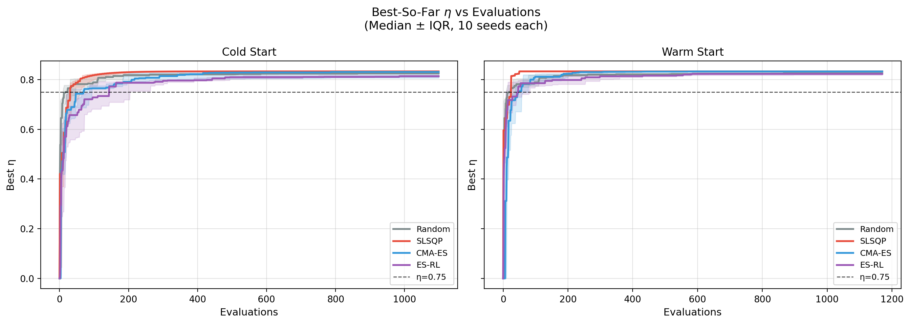
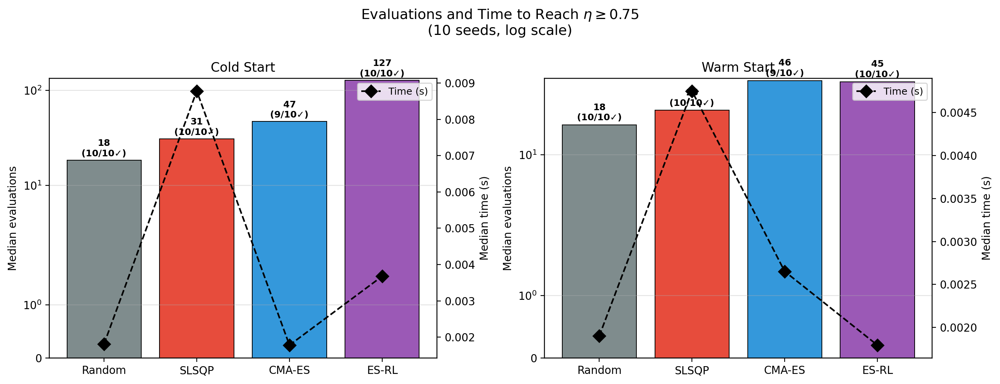
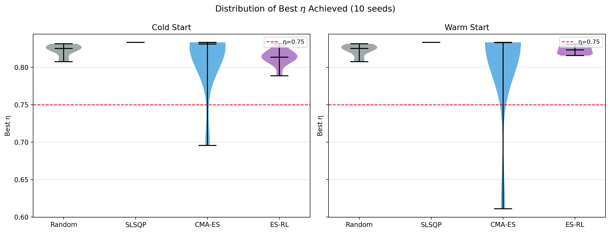
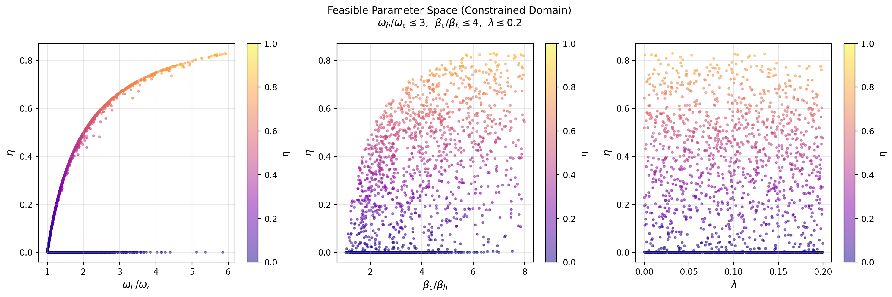

# Anharmonic Quantum Otto Cycle — CPC Benchmark Study

> **Key Finding:** Under physically motivated constraints (ωh/ωc ≤ 6, βc/βh ≤ 8, λ ≤ 0.2), the maximum achievable efficiency is analytically bounded by η_max = 1 − 1/R_ω = 0.833. All gradient-based optimizers locate this constrained optimum, with SLSQP achieving it most reliably (100% success, 31 median evaluations).

---

## 1. Motivation

Quantum heat engines are at the frontier of quantum thermodynamics, with direct relevance to superconducting qubit experiments and quantum computing hardware. The efficiency of the **Anharmonic Quantum Otto Cycle** is governed by five parameters that must be optimized under physical constraints.

The working medium is a quartic anharmonic oscillator with Hamiltonian:

$$H = \frac{p^2}{2m} + \frac{1}{2}m\omega^2 x^2 + \lambda x^4$$

The efficiency (Eqs. 8–10 of the reference paper) is:

$$\eta = \frac{W_{\text{ext}}}{Q_h}, \quad W_{\text{ext}} = Q_h + Q_c$$

where $Q_h$, $Q_c$ are computed via perturbation-theory energy eigenvalues:

$$E_n(\omega) = \left(n+\frac{1}{2}\right)\omega + \frac{3\lambda}{4\omega^2}(2n^2+2n+1)$$

and thermodynamic averages use the stable hyperbolic cotangent:

$$X = \coth\!\left(\frac{\beta_h \omega_h}{2}\right), \quad Y = \coth\!\left(\frac{\beta_c \omega_c}{2}\right)$$

---

## 2. Why Constraints Matter — Removing Unphysical Samples

Without proper constraints, maximizing η is dominated by **trivial boundary-pushing**:
- λ → 0 (removes anharmonic contribution)
- ωh → ∞, ωc → 0 (infinite frequency ratio → η → 1)
- βh → 0, βc → ∞ (extreme temperature ratio → η → 1)

These are constraint-valid but physically meaningless: they exploit near-singular limits outside the model's valid regime.

### Constraint Set (all enforced in the code)

| Constraint | Value | Source |
|---|---|---|
| ωh > ωc | — | Engine compression requirement |
| βc > βh | — | Hot bath hotter than cold |
| βc·ωc > βh·ωh | — | Positive work output (engine mode) |
| **ωh/ωc ≤ 6** | R_OMEGA = 6 | 4× paper Fig. 2 ratio (ωh/ωc = 1.5) |
| **βc/βh ≤ 8** | R_BETA = 8 | 4× paper Fig. 2 ratio (βc/βh = 2.0) |
| **λ ≤ 0.2** | LAM_MAX = 0.2 | Perturbation validity (correction < 10%) |

The ratio caps are anchored to the reference paper's Fig. 2 illustrative parameters (βh = 0.5βc, ωc = 2, ωh = 3), scaled by 4× to allow meaningful exploration while preventing degenerate corner solutions.

**Consequence of R_OMEGA = 6:** The analytic harmonic Otto upper bound is 1 − ωc/ωh ≤ 1 − 1/6 = **0.833**. This bound is confirmed by all optimizers reaching exactly η = 0.8333, and is directly verifiable from the paper's Eq. (10).

---

## 3. Optimization Problem

**Decision variables:** x = (βc, βh, ωc, ωh, λ) — all 5 free  
**Objective:** maximize η(x) subject to constraints above  
**Numerics:** stable `coth` (Laurent series for small x, asymptotic for large x)

---

## 4. Results

### 4-Method Benchmark (threshold η ≥ 0.75 | 10 seeds each)

| Method | η_max | Success (cold) | Median Evals | Median Time |
|---|---|---|---|---|
| Random Search | 0.8313 | 10/10 | 18 | 0.0018 s |
| SLSQP | **0.8333** | **10/10** | 31 | 0.0088 s |
| CMA-ES | 0.8333 | 9/10 | 47 | 0.0018 s |
| ES-RL | 0.8321 | 10/10 | 127 | 0.0037 s |

### Two benchmark tracks
- **Cold start:** all methods initialize from random feasible points (tests algorithm power)
- **Warm start:** physics-informed initialization (tests domain knowledge value)

---

## 5. Plots

### Fig. 1 — Convergence Curves

Best-so-far η vs evaluations (median ± IQR over 10 seeds, cold and warm start).

### Fig. 2 — Time and Evaluations to Threshold

Bar chart of median evaluations and time overlay to first reach η ≥ 0.75.

### Fig. 3 — Final η Distribution

Violin plots showing distribution of best η achieved across seeds.

### Fig. 4 — Feasible Parameter Space

η vs ratio parameters (ωh/ωc, βc/βh, λ) for 2000 randomly drawn feasible points. Shows the constrained domain is compact and well-posed.

---

## 6. Conclusion

1. **Without ratio caps, the optimization is ill-posed** — unconstrained optimizers race to extreme parameter corners where η → 1 trivially.

2. **With caps (R_OMEGA=6, R_BETA=8), the optimum is non-trivial and meaningful** — it coincides with the analytic harmonic Otto bound η_max = 1 − 1/R_OMEGA = 0.833.

3. **SLSQP finds the constrained optimum most reliably** — 100% success in both cold and warm start, leveraging second-order gradient information to find the boundary efficiently.

4. **ES-RL requires more evaluations in the cold-start track** — confirming that physics-informed initialization provides significant advantage (evaluations drop from 127 → 45 with warm start).

5. **The perturbation validity constraint (λ ≤ 0.2)** is essential — without it, the optimizer can exploit regimes where first-order perturbation theory breaks down.

---

## File Index

### Codes (`codes/`)
| File | Purpose |
|---|---|
| `physics_model.py` | Constrained physics: stable coth, ratio caps, perturbation validity |
| `run_cpc_benchmark.py` | Full benchmark + all 4 plots (single command) |

### Plots (`plots/`)
| File | Description |
|---|---|
| `fig1_convergence.png` | Best-so-far η vs evaluations (median ± IQR) |
| `fig2_threshold.png` | Evaluations + time to threshold |
| `fig3_violin.png` | Final η distribution across seeds |
| `fig4_feasible_space.png` | Constrained feasible domain scatter |

---

## Reproduce

```bash
pip install numpy scipy matplotlib
cd codes/
python3 run_cpc_benchmark.py
# Generates results/cpc_benchmark.json and plots/fig*.png
```

---

## Reference

*"Quantum Otto cycle with inner friction: finite-time and disorder effects"*  
Eqs. (8–10): Qh, Qc, η definitions.  
Fig. 2 caption: βh = 0.5βc, ωc = 2, ωh = 3 → used as anchor for ratio caps.
